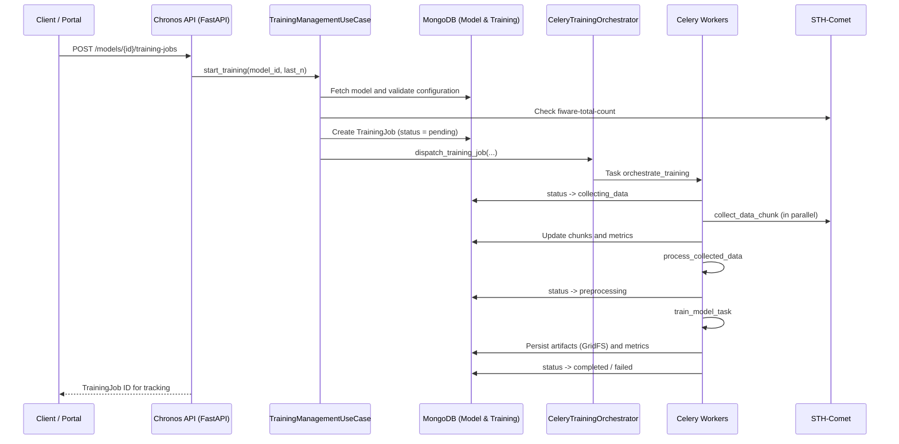
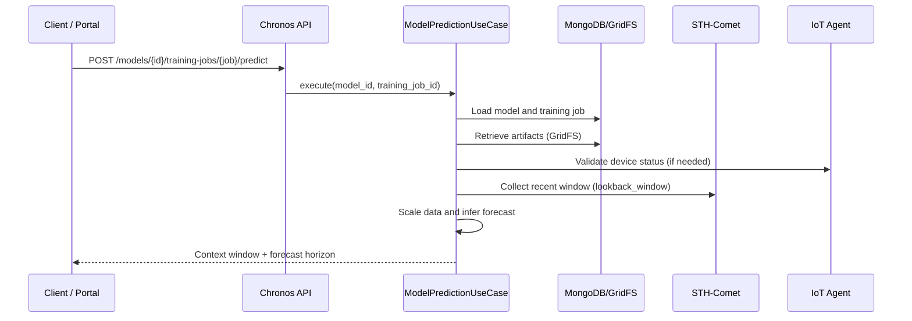
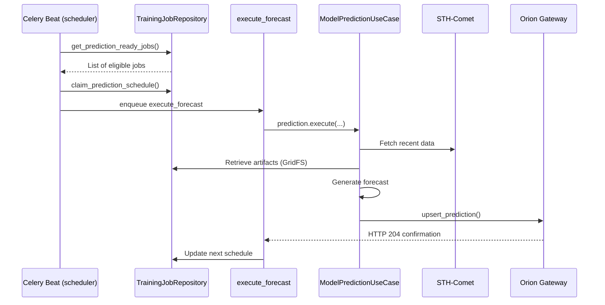

# FIWARE Chronos

[](https://opensource.org/licenses/MIT)
[](https://www.python.org/downloads/)
[](https://fastapi.tiangolo.com/)
[](https://www.mongodb.com/)

## 📚 Table of Contents

- [Overview](#overview)
- [Architecture & Components](#architecture--components)
  - [Clean Architecture Layers](#clean-architecture-layers)
- [Operational Flows](#operational-flows)
  - [Model Lifecycle](#model-lifecycle)
  - [Asynchronous Training](#asynchronous-training)
  - [On-Demand Forecasts](#on-demand-forecasts)
  - [Recurring Forecasts & Orion](#recurring-forecasts--orion)
  - [Device Discovery](#device-discovery)
- [Modeling & Persistence](#modeling--persistence)
- [FIWARE Integrations](#fiware-integrations)
- [Environment Preparation (Linux)](#environment-preparation-linux)
- [Python Project Setup](#python-project-setup)
- [Docker Execution](#docker-execution)
- [Development Commands](#development-commands)
- [Quality & Testing](#quality--testing)
- [API & Documentation](#api--documentation)
- [Observability & Logging](#observability--logging)
- [Repository Structure](#repository-structure)
- [License](#license)

## Overview

**FIWARE Chronos** is a Generic Enabler (GE) focused on training and operating time-series forecasting models integrated with the FIWARE ecosystem. It provides:

- End-to-end lifecycle management for LSTM/GRU models targeting sensors managed by Orion Context Broker.
- Asynchronous training orchestration with parallel data collection from STH-Comet and TensorFlow processing.
- On-demand forecasting along with automated scheduling of recurring predictions published to Orion.
- Native integration with IoT Agent, STH-Comet, Orion, MongoDB/GridFS repositories, and Celery.

The repository aligns with FIWARE Generic Enabler guidelines, offering documentation, infrastructure scripts, observability (Grafana/Loki), and quality automation.

## Architecture & Components


### Clean Architecture Layers

- **Domain:** Entities (`Model`, `TrainingJob`, `PredictionRecord`) and business rules with no external dependencies.
- **Application:** Use cases (`TrainingManagementUseCase`, `ModelPredictionUseCase`, etc.) orchestrating flows between domain and infrastructure.
- **Infrastructure:** MongoDB/GridFS repositories, FIWARE gateways (STH, Orion, IoT Agent), Celery orchestrator, and runtime settings.
- **Presentation:** FastAPI controllers grouped by context (`models`, `training`, `predictions`, `devices`, `system`).
- **Main:** `src/main` aggregates the dependency container and initializes the API/workers.

See `docs/clean_architecture_db.md` for repository details and `docs/logging.md` for structured logging configuration.

## Operational Flows

### Model Lifecycle

1. **Create** via `POST /models`, defining architecture, hyperparameters, and FIWARE metadata (entity, attribute, windows).
2. **Update** (`PATCH /models/{id}`) to fine-tune RNN/Dense layers, validation/test ratios, and FIWARE information.
3. **List** models with filters by status, type, entity, and feature.
4. **Delete** removes associated artifacts and marks the model as unavailable.

Models remain in `draft` until at least one training completes successfully, when they switch to `trained`.

### Asynchronous Training



Key notes:

- Data is collected in chunks respecting `FIWARE_STH_MAX_PER_REQUEST`.
- Artifacts are stored in GridFS (`model`, `x_scaler`, `y_scaler`, `metadata`).
- Validation/test metrics (MAE, RMSE, R², etc.) are persisted in `training_jobs`.

### On-Demand Forecasts



The response includes:

- Context window used for inference.
- Forecast series with inferred timestamps.
- Relevant training metadata (best epoch, metrics).

### Recurring Forecasts & Orion



Enabling (`POST /prediction-toggle`) ensures:

- Automatic creation of service group and device in IoT Agent to publish `forecastSeries`.
- Registration of a `Prediction` entity in Orion with an optional subscription for STH.
- Persistence of `sampling_interval_seconds` for continuous scheduling.

### Device Discovery

- `GET /devices` integrates with IoT Agent (`/iot/devices`), grouping sensors by `entity_type`.
- Helps operators select valid `entity_id`/`feature` pairs when creating models.
- Supports configurable FIWARE headers (`fiware-service`, `fiware-servicepath`) via query parameters.

## Modeling & Persistence

| Layer | Storage | Description |
|-------|---------|-------------|
| Models | MongoDB `models` | Neural network configurations, hyperparameters, FIWARE metadata. |
| Training Jobs | MongoDB `training_jobs` | Execution history, phases, metrics, scheduling, prediction flags. |
| Artifacts | GridFS (`fs.files`/`fs.chunks`) | Keras weights (`.h5`), scalers (`joblib`), JSON metadata. |
| Logs | Loki (Docker) / stdout | `structlog` structured logs with Promtail integration. |
| Messaging | RabbitMQ + Redis | Broker and backend for Celery tasks. |

Collections are indexed by frequent lookup fields (`id`, `model_id`). Infrastructure vs domain separation is detailed in `docs/clean_architecture_db.md`.

## FIWARE Integrations

| Component | Responsibility | Inputs/Outputs | Implementation |
|-----------|----------------|----------------|----------------|
| STH-Comet | Historical collection (`collect_data`, `fiware-total-count`) and forecast storage via subscription | `hLimit`, `hOffset`, `fiware-service` | `src/infrastructure/gateways/sth_comet_gateway.py`, task `collect_data_chunk` |
| Orion Context Broker | Publishing forecasts (`forecastSeries`) and creating entities/subscriptions | `PredictionRecord` -> `/v2/entities`, `/v2/subscriptions` | `src/infrastructure/gateways/orion_gateway.py`, task `execute_forecast` |
| IoT Agent | Discovering/provisioning devices and service groups for forecasts | `/iot/devices`, `/iot/services` | `src/infrastructure/gateways/iot_agent_gateway.py`, use case `TogglePredictionUseCase` |
| IoT/Sensors | Original data source | NGSI-LD entities | Configured via Orion + IoT Agent |

Configure FIWARE endpoints in `.env`:

```
FIWARE_ORION_URL=http://orion:1026
FIWARE_STH_URL=http://sth-comet:8666
FIWARE_IOT_AGENT_URL=http://iot-agent:4041
FIWARE_SERVICE=smart
FIWARE_SERVICE_PATH=/
```

## Environment Preparation (Linux)

```
sudo apt update && sudo apt -y upgrade
sudo apt install -y git make build-essential python3 python3-venv python3-pip python3-dev \
    libffi-dev libssl-dev libatlas-base-dev
```

TensorFlow CPU relies on optimized floating-point instructions; ensure the host supports AVX. For GPU workloads, use custom images.

## Python Project Setup

```
# Clone the repository
git clone https://github.com/tcc-chronos/fiware-chronos.git
cd fiware-chronos

# Create and activate virtual environment
python3 -m venv .venv
source .venv/bin/activate

# Install dependencies
pip install --upgrade pip
pip install -r requirements.txt

# Configure environment variables
cp .env.example .env
${EDITOR:-nano} .env  # Adjust FIWARE URLs, credentials, ports

# Quality hooks
pre-commit install
pre-commit run --all-files
```

For local API development:

```
make run  # uvicorn with reload and .env configuration
```

## Docker Execution

1. Update `.env` with the URLs of your FIWARE ecosystem.
2. Build and start the full stack (API, worker, scheduler, Mongo, RabbitMQ, Redis, Grafana, Loki, Promtail):
   ```bash
   make up ARGS="--build -d"
   ```
3. To stop everything:
   ```bash
   make stop
   ```

Available services:

- API: `http://localhost:${GE_PORT:-8000}`
- RabbitMQ Management: `http://localhost:15672` (default user/password `chronos`)
- Redis: `localhost:6379`
- MongoDB: `mongodb://localhost:27017`
- Grafana: `http://localhost:3000` (`admin/admin`)
- Loki: `http://localhost:3100`

Celery workers use the queues:

- `orchestration`: job control
- `data_collection`: parallel STH collection
- `forecast_execution`: automated predictions

## Development Commands

```
make run                    # FastAPI server via uvicorn
make up ARGS="--build -d"   # Spin up Docker stack (API + workers + deps)
make stop                   # Stop active containers
make format                 # black + isort
make lint                   # flake8 + mypy
make test ARGS="-q"         # pytest with coverage
```

Helper scripts live in `scripts/`:

- `scripts/run_api.sh`: starts the API using `.env` configuration.
- `scripts/docker/docker_up.sh`: wrapper around `docker compose`.

## Quality & Testing

- **Lint/Type Check:** `make lint` (flake8 + mypy).
- **Formatting:** `make format` (black + isort).
- **Tests:** `make test` produces coverage reports under `htmlcov/index.html`.
- **Pre-commit:** automatically runs on every commit (black, isort, flake8, mypy, pytest, detect-secrets if configured).

Run `pre-commit run --all-files` after dependency updates.

## API & Documentation

- Interactive docs: `http://localhost:8000/docs`
- OpenAPI schema (JSON): `http://localhost:8000/openapi.json`

Core endpoints:

| Resource | Method | Description |
|----------|--------|-------------|
| `/models` | GET/POST | List and create models |
| `/models/{model_id}` | GET/PATCH/DELETE | Manage models |
| `/models/types` | GET | Supported options (LSTM, GRU) |
| `/models/{model_id}/training-jobs` | GET/POST | Training history and execution |
| `/models/{model_id}/training-jobs/{training_job_id}` | GET | Job details |
| `/models/{model_id}/training-jobs/{training_job_id}/predict` | POST | On-demand forecast |
| `/models/{model_id}/training-jobs/{training_job_id}/prediction-toggle` | POST | Enable/disable recurring forecasts |
| `/models/{model_id}/training-jobs/{training_job_id}/predictions/history` | GET | Retrieve STH-stored forecast history |
| `/devices` | GET | Discover devices registered in IoT Agent |
| `/health` | GET | Dependency health check |
| `/info` | GET | Application metadata |

## Observability & Logging

- **Loki + Promtail:** collect structured logs from API and workers; configure Grafana dashboards using the Loki datasource.
- **Grafana:** customizable dashboards for training metrics, queue consumption, and health checks. Default credentials `admin/admin`.
- **Structured Logging:** powered by `structlog`, with optional JSON or plain text depending on `LOG_LEVEL`, `LOG_FORMAT`.
- **Resource Monitoring:** RabbitMQ Management UI (`:15672`) to track queue usage and Celery jobs.

## Repository Structure

```
fiware-chronos/
├── deploy/                # Dockerfiles, docker-compose, observability
├── docs/                  # Supplementary docs (Clean Architecture, logging)
├── scripts/               # Utility scripts (docker, lint, run)
├── src/
│   ├── domain/            # Entities and repository/gateway contracts
│   ├── application/       # Use cases (model, training, prediction, devices)
│   ├── infrastructure/    # Mongo/GridFS repositories, FIWARE gateways, Celery tasks
│   ├── presentation/      # FastAPI controllers
│   └── main/              # Dependency container and bootstrapping
├── tests/                 # Unit, integration, and e2e tests
├── Makefile               # Automation commands
├── requirements.txt       # Python dependencies
└── .env.example           # Configuration base for FIWARE environments
```

## License

This project is licensed under the MIT License. See `LICENSE` for details.
