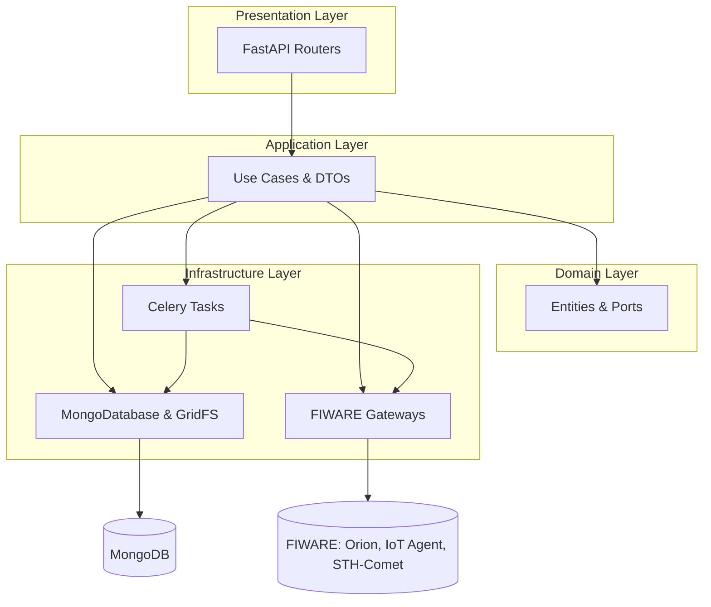
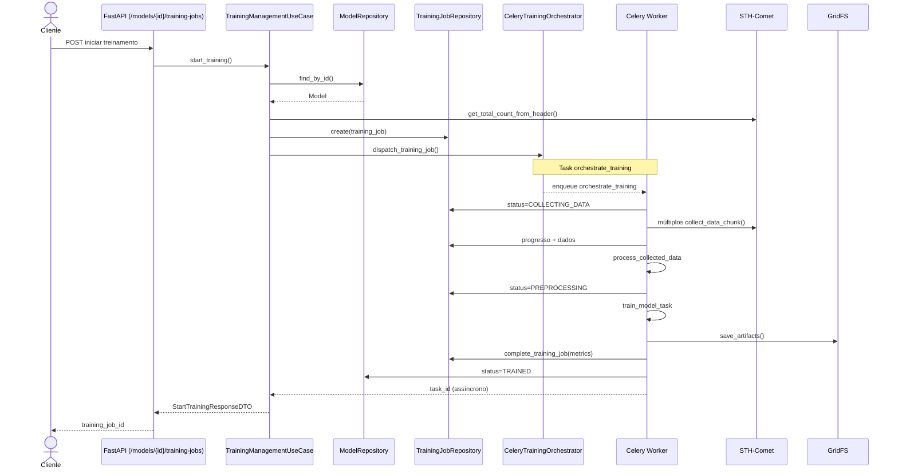
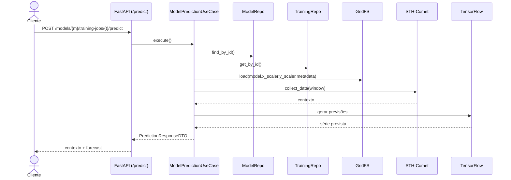
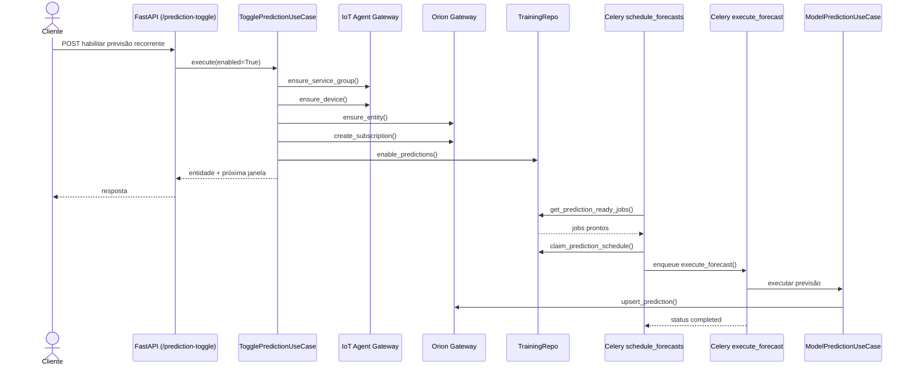
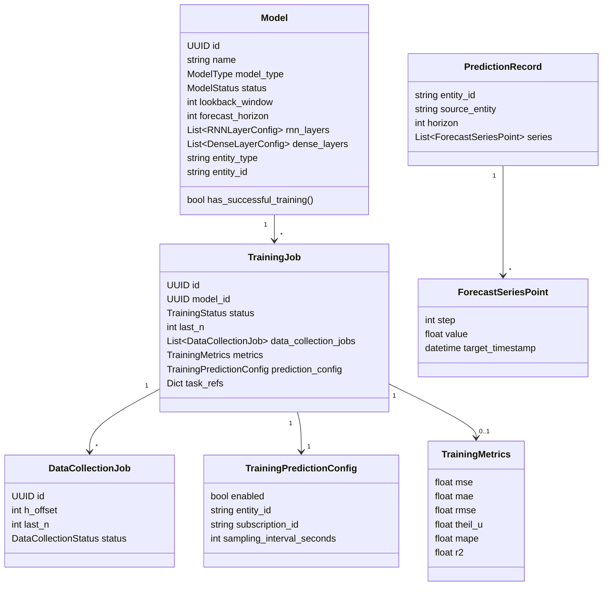

# Fiware Chronos GE — Documentação de Arquitetura

## Visão Geral

O Fiware Chronos GE fornece uma solução completa para orquestrar treinamento e inferência de modelos de séries temporais integrados ao ecossistema FIWARE. A API síncrona é construída com FastAPI, enquanto pipelines longos são delegados a workers Celery. O estado da aplicação, configurações de modelos e artefatos treinados ficam armazenados em MongoDB/GridFS, com RabbitMQ e Redis responsivos pela infraestrutura de mensageria.

## Macroarquitetura

O projeto segue Clean Architecture, isolando responsabilidades por camadas (`presentation`, `application`, `domain`, `infrastructure`) e centralizando a composição de dependências no `AppContainer`. As configurações são tipadas com Pydantic (`AppSettings`) e disponibilizam endpoints e credenciais de MongoDB, FIWARE, Celery e logging.

## Fluxos Primários

### Treinamento ponta a ponta

### Previsão sob demanda

### Predições recorrentes

## Endpoints HTTP

| Método | Caminho | Caso de Uso | Observações |
| --- | --- | --- | --- |
| GET | `/health` | GetHealthStatusUseCase | Estado de Mongo, RabbitMQ, Redis, Orion, IoT Agent e STH. |
| GET | `/info` | GetApplicationInfoUseCase | Uptime, commit, URLs FIWARE, status agregado. |
| GET | `/devices/` | GetDevicesUseCase | Agrupa devices por `entity_type`, ignora grupo de forecast. |
| GET | `/models/` | GetModelsUseCase | Filtros `model_type`, `status`, `entity_id`, `feature`; paginação. |
| GET | `/models/types` | GetModelTypesUseCase | Lista `ModelType` suportados (LSTM, GRU). |
| GET | `/models/{id}` | GetModelByIdUseCase | Configuração detalhada e histórico de treinamentos. |
| POST | `/models/` | CreateModelUseCase | Cria modelos validados; gera nome/descrição padrão. |
| PATCH | `/models/{id}` | UpdateModelUseCase | Restringe a status `draft`; warning para última camada redundante. |
| DELETE | `/models/{id}` | DeleteModelUseCase | Remove modelo, artefatos, devices IoT e entidades Orion ligadas. |
| GET | `/models/{id}/training-jobs` | TrainingManagementUseCase | Lista jobs com progresso, métricas e histórico. |
| GET | `/models/{id}/training-jobs/{job}` | TrainingManagementUseCase | Detalha fases, artefatos e erros. |
| POST | `/models/{id}/training-jobs` | TrainingManagementUseCase | Inicia pipeline (valida STH, splits e estado). |
| POST | `/models/{id}/training-jobs/{job}/cancel` | TrainingManagementUseCase | Revoga tasks, marca `cancelled` e agenda limpeza. |
| DELETE | `/models/{id}/training-jobs/{job}` | TrainingManagementUseCase | Exclui artefatos e recursos FIWARE de jobs encerrados. |
| POST | `/models/{id}/training-jobs/{job}/predict` | ModelPredictionUseCase | Previsão imediata com artefatos persistidos. |
| POST | `/models/{id}/training-jobs/{job}/prediction-toggle` | TogglePredictionUseCase | Liga/desliga publicação automática no Orion/STH. |
| GET | `/models/{id}/training-jobs/{job}/predictions/history` | GetPredictionHistoryUseCase | Consulta histórico de forecasts no STH. |

## Workers Celery

Em vez de executar coleta, pré-processamento e treinamento dentro do request HTTP (o que bloquearia a API por horas), o projeto utiliza Celery para distribuir essas tarefas como jobs assíncronos. Cada worker Celery roda o mesmo código Python do projeto, mas consome mensagens de filas específicas e executa em paralelo e de forma resiliente, permitindo *retries*, cancelamento, supervisão de progresso e isolamento de falhas.

### RabbitMQ (message broker)

É o ponto central de enfileiramento. A aplicação FastAPI publica mensagens nas filas `orchestration`, `data_collection`, `model_training`, `forecast_scheduling` e `forecast_execution`. O RabbitMQ garante entrega confiável, armazenamento durável e roteamento para os workers corretos. Em cenários de pico ou instabilidade de rede, ele mantém as mensagens até que um worker consiga processá-las com sucesso.

### Redis (result backend)

Armazena o estado das tasks Celery (PENDING, STARTED, RETRY, SUCCESS, FAILURE) e seus resultados. Essa camada permite que a API e o painel Celery/Flower consultem progresso, recuperem retornos e façam *revokes* direcionados. Além disso, o backend Redis é usado para agendamentos do `schedule_forecasts`, servindo como storage de curto prazo e suporte a visibilidade de tarefas.

- **orchestrate_training**: cria estratégia de coleta (chunks), programa chord e atualiza status do job.
- **collect_data_chunk** (fila `data_collection`): busca blocos no STH, registra progresso e aplica retries exponenciais.
- **process_collected_data** (fila `orchestration`): agrupa dados, calcula intervalo de amostragem e dispara `train_model_task`.
- **train_model_task** (fila `model_training`): executa pipeline Keras, persiste artefatos em GridFS, atualiza métricas e estado do modelo.
- **cleanup_training_tasks**: limpa referências residuais (`task_refs`) pós cancelamento/conclusão.
- **schedule_forecasts** (beat): faz polling periódico, reclama agendas e enfileira `execute_forecast`.
- **execute_forecast** (fila `forecast_execution`): reutiliza `ModelPredictionUseCase` e publica a previsão no Orion.

## Integrações FIWARE

- **IoT Agent**: leitura de dispositivos existentes, criação de `service groups` e devices dedicados a entidades de previsão (atributo `forecastSeries`), remoção quando necessário.
- **Orion Context Broker**: garantia de entidades e subscriptions NGSI v2, upsert de previsões em formato `StructuredValue` com horizonte, pontos e metadata `TimeInstant`.
- **STH-Comet**: coleta histórica paginada (`hLimit`/`hOffset`), leitura de disponibilidade pelo header `fiware-total-count` e armazenamento das previsões recorrentes para consulta futura.

## Persistência

- **MongoDB**: coleção `models` guarda configurações e estado (`ModelStatus`), enquanto `training_jobs` persiste `TrainingJob`, `DataCollectionJob`, `TrainingPredictionConfig`, métricas e `task_refs`. Índices são criados em startup para filtros frequentes (`status`, `model_type`, `entity_id`, `prediction_config.enabled`, `next_prediction_at`).
- **GridFS (model_artifacts)**: armazena versões de modelo treinado, escalers e metadata JSON (colunas, histórico de loss, métricas). Esses artefatos são consumidos na previsão on demand e removidos quando jobs/modelos são descartados.

## Modelo de Domínio

## Observabilidade

- `HealthCheckService` faz ping paralelo em Mongo, RabbitMQ (via `pika`), Redis, IoT Agent, Orion e STH, registrando latências e mensagens detalhadas para `SystemHealthDTO`.
- Logging estruturado com `structlog`, formato JSON em produção e console no desenvolvimento, inicializado antes do carregamento das configurações completas para garantir rastreabilidade desde o bootstrap.
