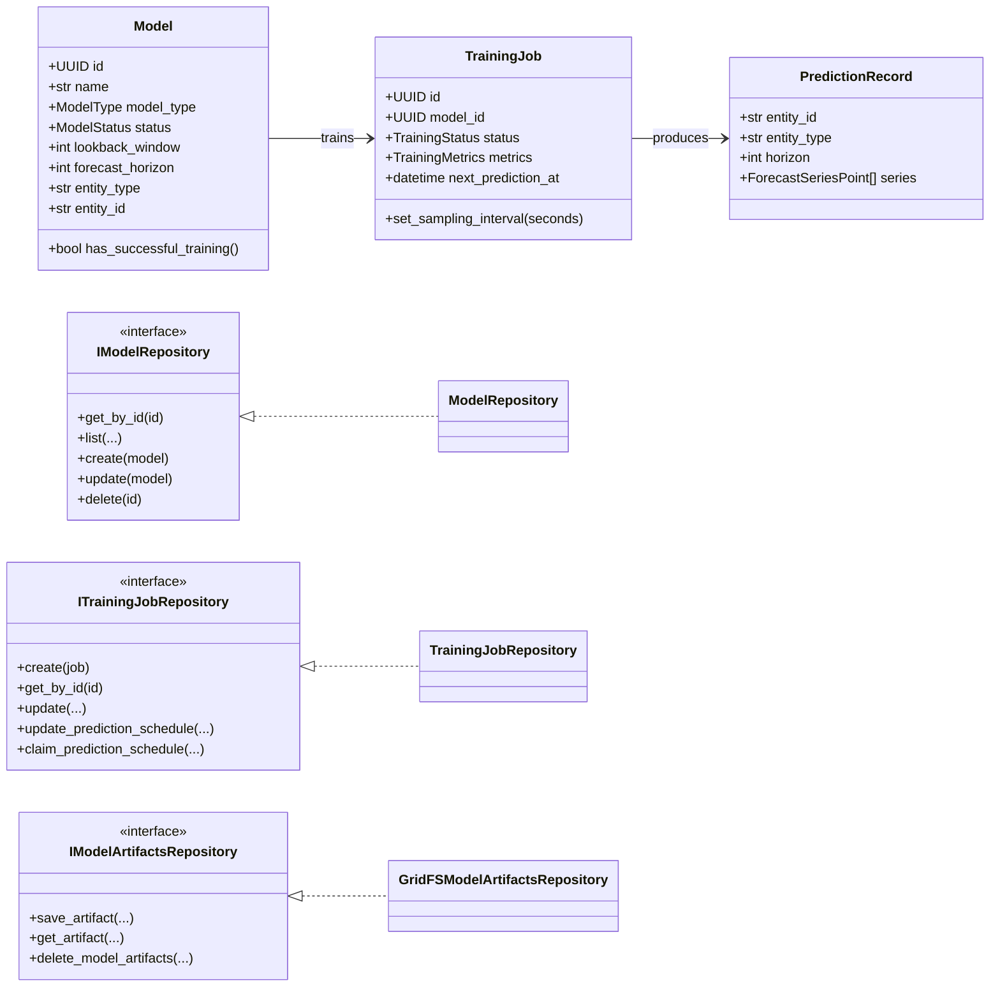

# Class Diagram (Logical)

This diagram presents the main domain entities, core interfaces (ports), and selected infrastructure implementations.

Note: This logical diagram focuses on relationships and interfaces rather than exhaustive attributes.
