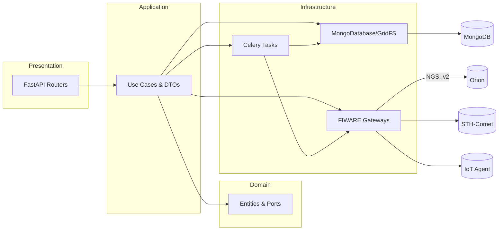

# Architecture Overview

Chronos adheres to Clean Architecture: domain‑centric, with infrastructure and presentation details at the edges. Long‑running operations are delegated to Celery workers.

## Layered View

## Key Components

- Presentation: FastAPI controllers under `src/presentation/controllers`.
- Application: Coordinating use cases in `src/application/use_cases`.
- Domain: Entities and interfaces in `src/domain`.
- Infrastructure: MongoDB access, GridFS, FIWARE gateways, Celery tasks.

## Execution Flows

See `sequence-diagrams.md` for detailed training, prediction, and scheduling flows.
