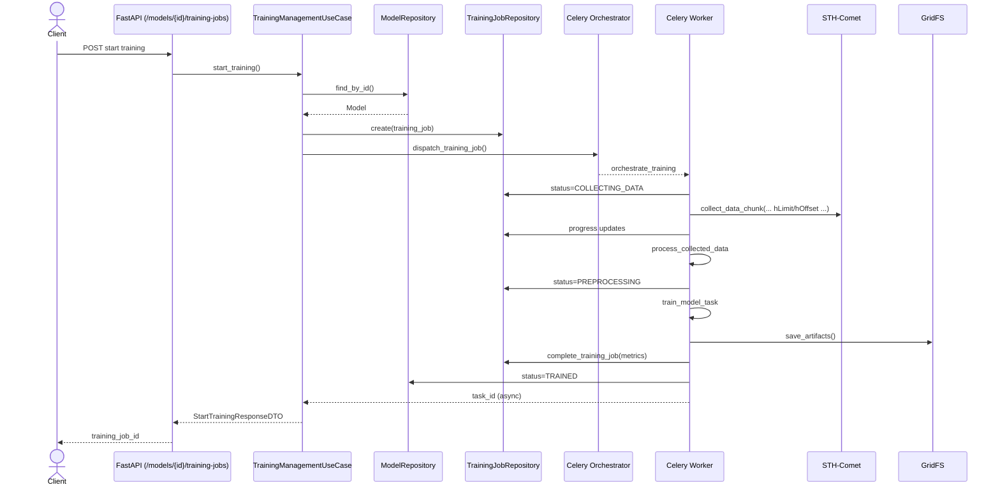
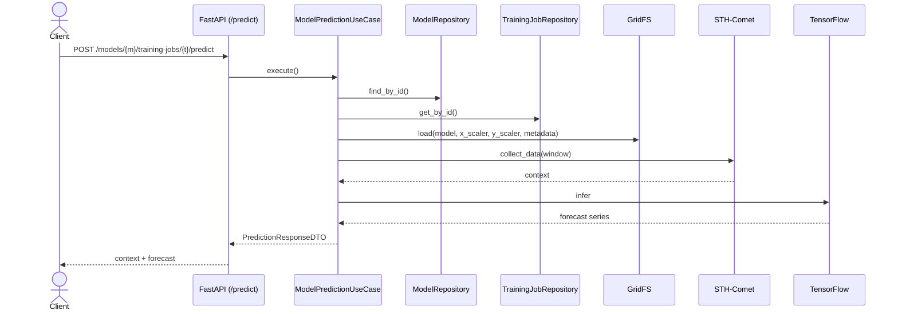
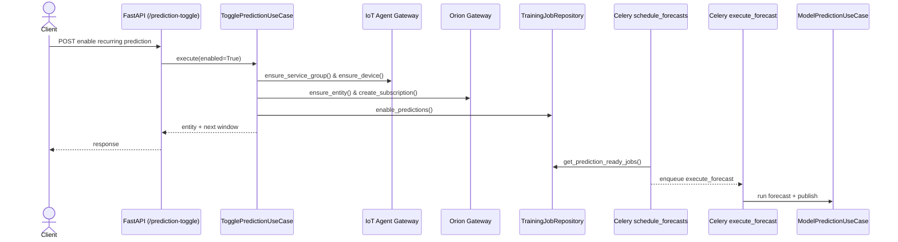

# Sequence Diagrams

This document illustrates key flows through Chronos.

## End-to-End Training

```mermaid
sequenceDiagram
  actor Client
  participant API as FastAPI (/models/{id}/training-jobs)
  participant UCase as TrainingManagementUseCase
  participant Models as ModelRepository
  participant Jobs as TrainingJobRepository
  participant Orchestrator as Celery Orchestrator
  participant Worker as Celery Worker
  participant STH as STH-Comet
  participant GridFS as GridFS

  Client->>API: POST start training
  API->>UCase: start_training()
  UCase->>Models: find_by_id()
  Models-->>UCase: Model
  UCase->>Jobs: create(training_job)
  UCase->>Orchestrator: dispatch_training_job()
  Orchestrator-->>Worker: orchestrate_training
  Worker->>Jobs: status=COLLECTING_DATA
  Worker->>STH: collect_data_chunk(... hLimit/hOffset ...)
  Worker->>Jobs: progress updates
  Worker->>Worker: process_collected_data
  Worker->>Jobs: status=PREPROCESSING
  Worker->>Worker: train_model_task
  Worker->>GridFS: save_artifacts()
  Worker->>Jobs: complete_training_job(metrics)
  Worker->>Models: status=TRAINED
  Worker-->>UCase: task_id (async)
  UCase-->>API: StartTrainingResponseDTO
  API-->>Client: training_job_id
```

## On-Demand Prediction

```mermaid
sequenceDiagram
  actor Client
  participant API as FastAPI (/predict)
  participant PredUC as ModelPredictionUseCase
  participant Models as ModelRepository
  participant Jobs as TrainingJobRepository
  participant Artifacts as GridFS
  participant STH as STH-Comet
  participant TF as TensorFlow

  Client->>API: POST /models/{m}/training-jobs/{t}/predict
  API->>PredUC: execute()
  PredUC->>Models: find_by_id()
  PredUC->>Jobs: get_by_id()
  PredUC->>Artifacts: load(model, x_scaler, y_scaler, metadata)
  PredUC->>STH: collect_data(window)
  STH-->>PredUC: context
  PredUC->>TF: infer
  TF-->>PredUC: forecast series
  PredUC-->>API: PredictionResponseDTO
  API-->>Client: context + forecast
```

## Recurring Predictions

```mermaid
sequenceDiagram
  actor Admin as Client
  participant API as FastAPI (/prediction-toggle)
  participant ToggleUC as TogglePredictionUseCase
  participant IoT as IoT Agent Gateway
  participant Orion as Orion Gateway
  participant Jobs as TrainingJobRepository
  participant Beat as Celery schedule_forecasts
  participant Exec as Celery execute_forecast
  participant PredUC as ModelPredictionUseCase

  Admin->>API: POST enable recurring prediction
  API->>ToggleUC: execute(enabled=True)
  ToggleUC->>IoT: ensure_service_group() & ensure_device()
  ToggleUC->>Orion: ensure_entity() & create_subscription()
  ToggleUC->>Jobs: enable_predictions()
  ToggleUC-->>API: entity + next window
  API-->>Admin: response
  Beat->>Jobs: get_prediction_ready_jobs()
  Beat-->>Exec: enqueue execute_forecast
  Exec->>PredUC: run forecast + publish
```

