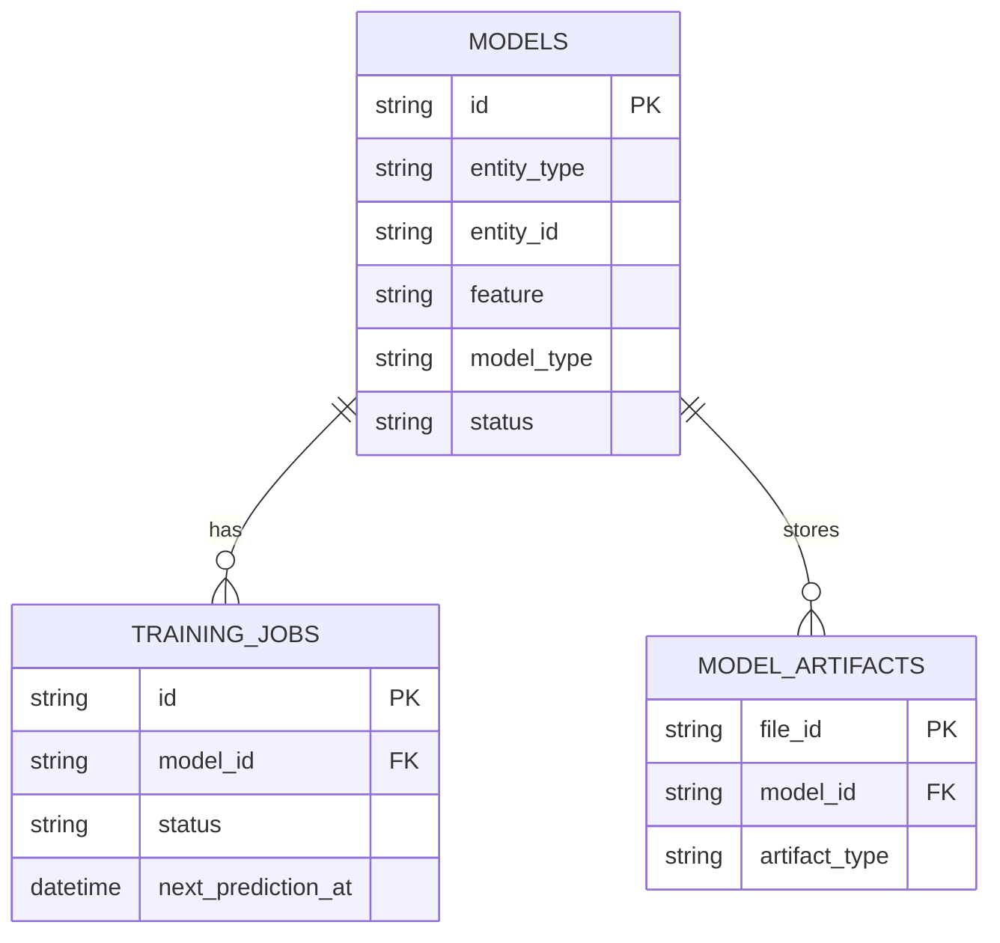

# Database Modeling

Chronos uses MongoDB as the primary data store and GridFS for large binary artifacts. This document describes collections, indexes, and relationships.

## Collections

### models

- Purpose: Store model definitions and training hyperparameters.
- Key fields:
  - `id: UUID` (string)
  - `name: string`
  - `description: string?`
  - `model_type: enum(lstm|gru)`
  - `status: enum(draft|training|trained)`
  - `batch_size, epochs, learning_rate`
  - `rnn_layers[], dense_layers[]`
  - `lookback_window, forecast_horizon`
  - `feature: string`
  - `entity_type: string`, `entity_id: string`
  - `created_at, updated_at, has_successful_training`
- Indexes (from startup routine):
  - Single: `created_at`, `status`, `model_type`, `entity_id`, `feature`
  - Compound: `(model_type, status)`, `(entity_id, feature)`

### training_jobs

- Purpose: Track training lifecycle, timings, metrics, and forecast scheduling.
- Key fields:
  - `id: UUID` (string)
  - `model_id: UUID` (string)
  - `status: enum(pending|collecting_data|preprocessing|training|completed|failed|cancelled|cancel_requested)`
  - `data_collection_jobs[]` with progress and `h_limit/h_offset`
  - `metrics` (MAE/MSE/RMSE/R2, loss)
  - `model_artifact_id, x_scaler_artifact_id, y_scaler_artifact_id, metadata_artifact_id`
  - `sampling_interval_seconds, next_prediction_at`
  - `prediction_config.enabled, prediction_config.interval_seconds`
  - `timestamps: created_at, updated_at, start_time, end_time, ...`
- Indexes:
  - `prediction_config.enabled`
  - `next_prediction_at`

### GridFS: model_artifacts.files / model_artifacts.chunks

- Purpose: Persist trained models and preprocessing artifacts.
- Metadata: `{ model_id, artifact_type, content_type, ... }`
- Types: `model`, `x_scaler`, `y_scaler`, `metadata`

## Relationships

- `training_jobs.model_id → models.id` (many‑to‑one)
- `GridFS.metadata.model_id → models.id` (many‑to‑one)

## Entity Diagram (logical)

## Notes

- All timestamps stored in UTC.
- UUIDs serialized as strings for compatibility.
- Repository layer maps BSON documents to domain entities.

